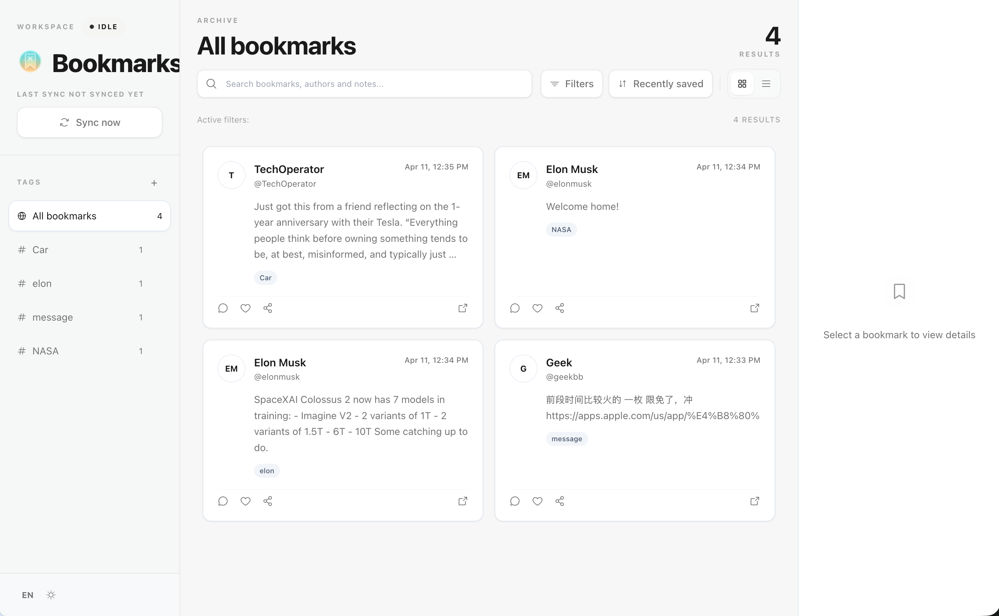
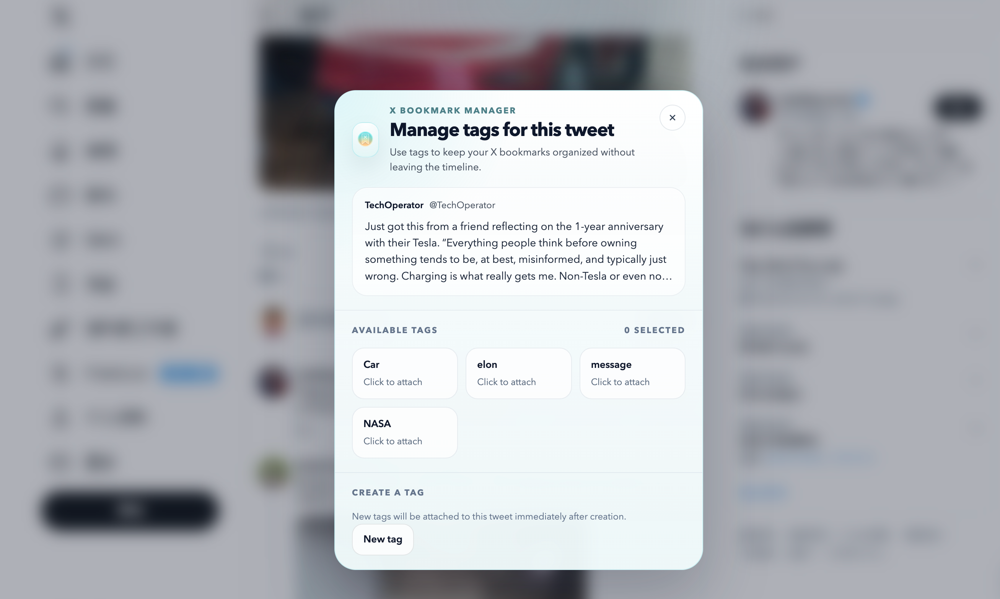

# X Bookmark Manager

[English README](./README.md)

## 产品预览

工作区总览



X 站内快速打标



X Bookmark Manager 是一个面向重度 X 用户的 Chrome 扩展，目标不是再造一个收藏夹，而是把 X 上越存越多的书签变成一个可同步、可整理、可回看的本地工作区。

## 为什么要用它

- X 原生书签很适合“先存下来”，但不适合“之后再找到它”。
- 当书签数量变多之后，缺少标签、筛选和归类规则，会让回看成本越来越高。
- 这个扩展的作用，是把书签从平铺列表变成一个本地优先的整理空间。

## 这个扩展能做什么

- 从 X 同步书签到本地 IndexedDB。
- 在 popup 里查看同步状态、本地库存和未分类数量。
- 打开完整管理器，在工作区里浏览、筛选和查看书签详情。
- 用列表和标签整理书签。
- 在 X 站内直接给书签打标签，不必离开时间线。
- 按作者、关键词、是否带媒体、是否长文等条件设置自动打标规则。
- 保持 local-first，数据存放在浏览器本地，而不是依赖托管服务。

## 适合谁

- 把 X 书签当成资料库来用的人。
- 希望把内容留在本地，而不是交给第三方 SaaS 的人。
- 需要“整理和回看”能力，而不只是“先收藏”的人。

## 如何安装

优先使用 Chrome Web Store 安装：

[Chrome Web Store 安装地址](https://chromewebstore.google.com/detail/x-bookmark-manager/olefipkonojnpmkikdlpacchbpfdleef)

或者本地构建：

```bash
npm install
npm run build
```

再加载到 Chrome：

1. 打开 `chrome://extensions`。
2. 开启开发者模式。
3. 点击 `Load unpacked`。
4. 选择 `build/chrome-mv3`。

## 如何使用

1. 在 Chrome 中登录 X。
2. 打开扩展 popup，点击 `Sync now`。
3. 等待首次同步完成。
4. 点击 `Open manager` 进入完整工作区。
5. 在管理器中浏览书签、筛选结果、附加标签，或把书签移动到列表。
6. 创建一套符合你自己整理习惯的标签。
7. 配置分类规则，让后续同步进来的书签自动打标。
8. 在浏览 X 时，直接使用站内内联打标签能力管理已收藏的推文。

## 一个常见使用流程

1. 平时照常在 X 上收藏内容。
2. 通过 popup 触发同步。
3. 打开管理器，优先处理未分类书签。
4. 建一套简单标签，例如 `AI`、`Product`、`Reading`、`To Review`。
5. 为高频作者或固定主题添加自动规则。
6. 后续回看时，直接在工作区中找内容，而不是翻原生书签列表。

## 数据与存储

- 书签数据保存在浏览器本地。
- 同步状态和工作区设置也保存在本地。
- 当前设计是 local-first，不依赖托管后端。

## 仓库结构

```text
assets/   扩展静态资源
scripts/  构建脚本
src/      扩展源码
tests/    自动化测试
```

## 开发命令

运行扩展测试：

```bash
npm test
```

运行静态检查：

```bash
npm run typecheck
npm run lint
```

## 构建产物

- 解包目录：`build/chrome-mv3`
- 压缩包：`build/chrome-mv3.zip`
